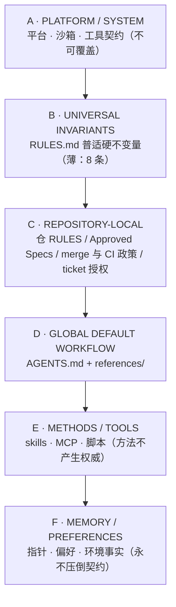

<div align="center">

# agent-engineering-governance


**FlapPearLabs 全局 AI Agent 工程治理基线**

让任何 AI Agent（WorkBuddy / Codex / Claude Code / Hermes / OpenCode / ZCode …）在任何项目里，以同一套受治理、可审计、可移植的工程流程工作。

[快速开始](#2-快速开始) · [复制即用引导提示词](#3-复制即用发给-agent-的引导提示词) · [工作流详解](#5-治理工作流详解) · [配置指南](#7-配置指南) · [FAQ](#11-faq)

</div>

> **AGENT_ENGINEERING_GOVERNANCE_V1.1.1 — CANONICAL**
>
> - `GOVERNANCE_CORE = PASS`（GPT-5.6 Sol 多轮评审收敛：权威分层 / Stage / Lane / 风险分级 / 评审收敛 / CI / exact-SHA / Seam-first 均已接受）
> - `PORTABLE_SETUP = READY`（见 [deployment/PORTABLE_SETUP.md](deployment/PORTABLE_SETUP.md)）
> - `BOOTSTRAP_STATIC_VALIDATION = PASS`（governance-ci green；自检以 `python3 scripts/validate_governance.py` 运行时输出全部 PASS 为准）
> - `BOOTSTRAP_LIVE_VALIDATION = NOT_RUN`（fresh-session 验收待受控部署后执行 —— 唯一遗留部署事项，非阻塞）

> 本仓是 FlapPearLabs 全部软件工程项目的 **canonical 治理 owner**：`audit/` 目录全部为**历史证据**，不是 runtime 权威；canonical runtime 权威 = `RULES.md` + `AGENTS.md` + `references/` + `deployment/` setup 文档。

> **本仓是 PUBLIC 仓库。** 因此公开产物只承载治理语义，不承载任何一台机器的身份或恢复细节：
>
> - **提交入库的**：治理文档、`references/`、`deployment/` setup 文档、校验器与测试——全部为公开治理产物。
> - **占位符形态的机器配置**：`deployment/deployment-profile.md` 是 PUBLIC-SAFE 模板，值一律写 `<PATH_TO_GH>` / `<LOCAL_PROXY_URL>` / `${HOME}` 等占位符（约定见该文件与 [mcp/README.md](mcp/README.md)）。
> - **local-only / 私有恢复数据**：真实机器档案 `deployment/deployment-profile.local.md` 已被 `.gitignore` 忽略，永不入库；旧 MEMORY 原始备份同样只存 Git 之外的私有存储（RULES R2）。
> - **公开发布校验**：`python3 scripts/validate_public_release.py`（当前树扫描，CI 强制；`--history` 做全历史扫描；`--selftest` 跑合成策略测试）。PUBLIC 模式下 `MACHINE-SPECIFIC ALLOWED` 标记**不产生任何豁免**；判定不依赖 GitHub API（`PUBLIC_RELEASE=1` 可离线强制）。

---

## 目录

- [1. 这是什么](#1-这是什么)
- [2. 快速开始](#2-快速开始)
- [3. 复制即用：发给 Agent 的引导提示词](#3-复制即用发给-agent-的引导提示词)
- [4. 权威模型：六层分层](#4-权威模型六层分层)
- [5. 治理工作流详解](#5-治理工作流详解)
- [6. 开发方法：ENGINEERING DOCTRINE 与证据路由](#6-开发方法engineering-doctrine-与证据路由)
- [7. 配置指南](#7-配置指南)
- [8. 仓库结构](#8-仓库结构)
- [9. 在新项目采用本基线](#9-在新项目采用本基线)
- [10. 当前状态与路线](#10-当前状态与路线)
- [11. FAQ](#11-faq)
- [12. 维护与治理变更](#12-维护与治理变更)
- [13. License](#13-license)

---

## 1. 这是什么

本仓回答三个工程问题：

| 问题 | 本仓给出的答案 |
|---|---|
| **Agent 按什么流程干活？** | Execution Stage 编组 → Ticket Lane 生命周期（合同抽取 + 反例 TDD + 独立评审 + real CI）→ 串行集成。详见 [AGENTS.md](AGENTS.md) 与 [references/](references/) |
| **Agent 的权威从哪来、谁覆盖谁？** | 六层权威模型（A 平台 > B 普适不变量 > C 仓权威 > D 全局默认 > E 方法 > F 记忆）。详见 §4 与 [audit/AUTHORITY_MAP_V2.md](audit/AUTHORITY_MAP_V2.md) |
| **新会话 / 新机器 / 新 runtime 如何可靠加载这套治理？** | MEMORY 指针 + 开工清单 + 机械自检（bootstrap 三件套）。详见 §2 / §7 与 [deployment/BOOTSTRAP_CONTRACT.md](deployment/BOOTSTRAP_CONTRACT.md) |

### 1.1 为什么存在

现行全局工程治理的全部权威曾寄宿在一份 29.8KB 的 runtime 记忆文件里，而该文件的会话注入在 **byte 4028 截断** —— 宪法的大部分对 agent 实际不可见；同时各项目仓手写 800+ 行 AGENTS.md，语义重复且漂移。

本仓把**治理内容**与**治理载体**解耦：

- **只有一个 canonical owner**（本仓），其他位置只留指针或项目 delta；
- 治理正文进 Git 版本化，评审、CI、exact-SHA 全程可审计；
- 机器专属事实与共享语义分区管理（RULES R2），仓内零凭据。

### 1.2 设计立场

- **RISK-SCALED RIGOR**：严格度随风险缩放，LOW 票不跑全链，HIGH 才升级强评审——治理不做官僚税。
- **AUTO-ADVANCE UNTIL REAL AUTHORITY UNCERTAINTY**：授权已覆盖的路径自动推进，只在真实权威不确定时停机问人。
- **SKILL_IS_METHOD / SKILL_IS_NOT_AUTHORITY**：工具与技能是执行方法，不产生权威；本仓不 vendor 任何第三方工具内容。

---

## 2. 快速开始

### 2.1 新 Agent 开工（17 步摘要）

完整步骤与降级路径见 [deployment/PORTABLE_SETUP.md](deployment/PORTABLE_SETUP.md)。你只需要**本仓 + 目标工程仓**，不依赖任何先前对话：

| 阶段 | 动作 |
|---|---|
| ① 读权威 | clone/打开本仓 → 读 `README.md` → `RULES.md` → `AGENTS.md` → 目标仓根 `AGENTS.md` / `RULES.md` / `docs/specs/*`（存在即读） |
| ② 调和权威 | 按 [audit/AUTHORITY_MAP_V2.md](audit/AUTHORITY_MAP_V2.md) 六层算法；C 覆盖 D 显式记录 `OVERRIDE = ...`；不可解析冲突 → `STOP: CONTRACT_CONFLICT` |
| ③ 检查 Skills | 按 [skills/README.md](skills/README.md) 主线 13 项核对，缺项按行 FALLBACK |
| ④ 检查 MCP | 按 [mcp/README.md](mcp/README.md) 三项 canonical（codegraph / context7 / gh_grep），缺项按 INSTALL 方法补齐 |
| ⑤ 验证 | CodeGraph/Context7/gh_grep 各一次健康查询；读 `deployment/deployment-profile.md` 识别宿主；跑 `python3 scripts/validate_governance.py` 要求全部 PASS |
| ⑥ 开工 | 输出 bootstrap receipt → 按 AGENTS.md 生命周期执行；授权路径自主推进，仅 §STOP 状态停机 |

### 2.2 进入既有项目（STATE_RESTORE）

**禁止以"请人讲历史"开局。** fetch remote → 读仓本地权威与 TARGET/SPEC/ADR/SPIKE → 检视 open Issues/PRs/tracker → 核对 exact branch SHAs 与 CI 状态 → 重构合法 frontier → 输出 recovery receipt：

```text
PROJECT =
REMOTE_DEFAULT_SHA =
TARGET = SPEC = ADR = SPIKES =
ACTIVE_STAGE = ACTIVE_TICKETS = ACTIVE_PRS =
BLOCKERS = DECISIONS_REQUIRED =
CURRENT_LEGAL_FRONTIER =
STATE_RECOVERY = COMPLETE / PARTIAL / BLOCKED
READY_TO_CONTINUE = YES / NO
```

### 2.3 三条最低不变量（B 层摘要）

即使后续加载全部失败，以下三条也应随引导可见（全文见 [RULES.md](RULES.md)）：

1. **凭据/secret 绝不进入** repo / log / 产物 / 长期记忆。
2. **证据真实性**：`UNKNOWN != PASS`；不伪造证据与新颖性；自分类仅是提案。
3. **独立评审 gate 存在时，self-review 不满足之**；不自批、不自合并。

---

## 3. 复制即用：发给 Agent 的引导提示词

把下面整个代码块复制给任何 agent（ChatGPT / Codex / WorkBuddy / Claude …）作为第一条消息，agent 即可按本仓流程与开发方法工作。若该 agent 能访问 GitHub，它会读取仓内原文；否则以内嵌摘要为准。

```text
你是 FlapPearLabs 的工程 Agent。本提示词使你以治理基线开工。
治理仓：https://github.com/FlapPearLabs/agent-engineering-governance（分支 main）。

【第 0 步 · 加载治理】
若你可访问 GitHub：读取该仓，按序 README.md → RULES.md → AGENTS.md → 目标仓根
AGENTS.md / RULES.md / docs/specs/*（存在即读）→ 相关 references/*.md。
否则以下方内嵌摘要为准，后续可核对原文。

【权威模型 · 六层（高者胜）】
A 平台/系统 > B 普适不变量(RULES.md) > C 仓库本地权威(仓 RULES/Spec/merge 政策/票授权)
> D 全局默认工作流(AGENTS.md + references/) > E 方法/工具 > F 记忆/偏好。
- C 覆盖 D 必须显式记录：OVERRIDE = <被覆盖条款> overridden by <权威> <条款> (source)。
- 加严永远合法，无需记录。不可解析的真实冲突 → STOP: CONTRACT_CONFLICT，交产品负责人裁决。

【B 层硬不变量 · 任何仓不得削弱】
R1 权威分层与冲突（如上）。
R2 凭据与机器私有信息安全：凭据/secret/私钥/cookie/本机登录身份绝不进入 repo/log/产物/记忆；
   提交到 Git 的工具/MCP 配置必须是占位符模板形态。
R3 证据真实性：UNKNOWN != PASS；一切 PASS 声明须有可复现证据；自分类仅是提案，
   接受需独立证据 + 独立侧接受（REVIEWER_ACCEPTED_CLASSIFICATION = YES）。
R4 独立评审完整性：独立评审 gate 存在时，自审（含 /code-review 类工具）不满足该 gate；
   不自批、不自合并、不派生受自己影响的 reviewer 冒充独立评审。
R5 已评审/已发布历史不被静默改写：不 force-push / amend / rebase 已评审候选分支；
   修复 = append-only 新 commit → 新 SHA → 适用 gate 按新 SHA 重审。
R6 Scope 诚实：只在票授权的语义范围内工作；发现合同空白 → STOP: CONTRACT_GAP；
   架构冲突 → STOP: CONTRACT_CONFLICT；不静默发明缺失语义。
R7 平台注入卫生：不把单一宿主的 shell/平台习惯设为组织级基线或注入其他平台。
R8 最小复杂性护栏：新增强制 gate 前必须回答"防哪次真实失效"。

【工程哲学 · 十条 doctrine】
先权威后行动；先理解后编辑；先自然缝后票据；先合同后代码；先反例后实现；
先证据后信心；自审不替代独立评审（gate 存在时）；严格度随风险缩放；
最小必要复杂性；授权已覆盖的路径自动推进、只在真实权威不确定时停机问人。

【单票生命周期 · Ticket Lane（MEDIUM 基线）】
AUTHORIZED TICKET → 记录 exact base SHA → 独立分支 + 隔离 worktree（一票一分支一写者）
→ 读权威 → 自然缝识别 → CodeGraph 接地（不可用则手工 surface manifest，如实标注）
→ Relevant Surface Manifest（上游生产者/调用方/下游消费方/状态与身份 owner/失败传播/安全边界）
→ Contract Extraction（INPUTS/OUTPUTS/PRECONDITIONS/POSTCONDITIONS/HARD_INVARIANTS/
  VALID_SUCCESS_CASES/FAIL_CLOSED_CASES/ALLOWED_FALLBACKS/FORBIDDEN_FALLBACKS/
  IDENTITY_DEPENDENCIES/PERSISTENCE_DEPENDENCIES/OWNERSHIP/OUT_OF_SCOPE）
→ 反例设计（先设计"看起来合理、过了显眼测试、仍违反合同"的实现）
→ TDD RED（RED 必须由目标反例断言触发；TEST_FILE_EXISTS != TDD_RED_PROVEN）
→ 实现 → GREEN → 回归 → fresh 独立评审（L1）
→（仅高价值 blocker）append-only repair → 新 SHA → 重审
→ PR → real PR CI →（触发时）post-CI / adversarial → merge gate
→ 串行集成（master 任一时刻至多一个 Integrator）→ remote verify → 更新 tracker。

【风险分级】
LOW（文档/fixture/机械配置/微型生产修复）：最小 grounding；非生产票可 L0-only 闭合
（仓政策允许时）；生产代码必须 L1。
MEDIUM（常规特性集成/已知接口/多模块）：必须 L1；全 baseline grounding；real CI。
HIGH（持久化/编排/状态/身份/provenance/选择器/安全边界）：必须 L1 + adversarial；
强反例 5–10；更强 CI 证据。
ESCALATION（升级至最强/外部独立评审）：架构不确定性；并发/canonical 权威语义；
安全/凭据边界；评审分歧未决；Approved Spec / governance 变更；里程碑终审；
高爆炸半径运行时语义。

【评审分级与修复收敛】
L0 机器核验（exact SHA/diff 语义范围/构建/lint/类型/测试/回归/secret 扫描）每票必做，
   机器能检出的缺陷在进入 L1 前修复并由测试证明（MACHINE BEFORE MODEL）。
L1 独立评审（fresh context + 独立 grounding + ≥2 个非复制的新反例）生产代码必须；
   不重复报告 L0 已可确定性检出的问题。
L2 按上面 ESCALATION 清单触发；不同模型族优先。
修复收敛按价值不按标签（SEVERITY != REPAIR_AUTHORITY）：任何 reviewer 驱动的修复先过
REPAIR_VALUE（IMPACT/REACHABILITY/EVIDENCE_STRENGTH/CONTRACT_CONFIDENCE/
REPAIR_COMPLEXITY/REGRESSION_RISK/DEFECT_CLASS）；高价值类默认 REPAIR_NOW
（身份/provenance 错配、validity 升级、fail-open、安全/凭据泄漏、现实持久化损坏、
陈旧产物复用、错误完成语义、显式合同违反、权威所有权违反）。
NORMAL_REVIEWER_DRIVEN_REPAIR_BUDGET = 2（默认值，owner/仓政策可覆盖并记录 OVERRIDE）；
已知高价值 blocker 永不因预算耗尽被豁免；预算耗尽 → CONVERGENCE_ARBITER 五选一
（REPAIR_MORE / SATURATION_REACHED / ARCHITECTURE_REOPEN / ROUTE_TO_OTHER_OWNER /
BACKLOG_LONG_TAIL）。目标态 = NO_KNOWN_HIGH_VALUE_BLOCKER + REPAIR_SATURATION_REACHED，
不是 ZERO_FINDINGS；每条未修复 finding 必带完整处置字段（DISPOSITION/WHY_NOT_REPAIRED/OWNER）。

【Git / CI 默认】
一票一分支一隔离 worktree；基于最新 remote master；禁止 master 直接施工。
Conventional Commits（feat/fix/docs/test/refactor/chore）；scope-clean。
署名：AUTHOR_NAME=FlapPearLabs、AUTHOR_EMAIL_CLASS=GITHUB_NOREPLY（repo-local git config）。
默认 ff-only 集成、master 串行（仓政策可定义 squash/merge commit 等合法形态并记录 OVERRIDE，
但已评审候选不得被静默改写）。每次集成前：fresh fetch → 核验 origin tip == REVIEWED_HEAD
→ master drift 检查 → merge → push → remote verify → 关 tracker。
LOCAL_TESTS != REAL_PR_CI；CI 状态不可坍缩：NOT_TRIGGERED / UNKNOWN /
KNOWN_BASELINE_FAILURE / SKIPPED 永不等于 PASS；任何非 PASS 状态必须附证据块
（CI_STATE/CI_TRIGGERED/CI_RUN_ID_OR_URL/CI_FAILURE_SIGNATURE/CI_BLOCKER_CLASS/
REVIEWER_ACCEPTED_CLASSIFICATION/REQUIRED_NEXT_ACTION）。

【自动推进与 STOP】
gate 满足就推进（评审过 → 集成 → remote verify → 更新 tracker → 下一票），
不问"是否继续"。仅在以下状态停机：USER_DECISION_REQUIRED / CONTRACT_CONFLICT /
SPEC_AMENDMENT_REQUIRED / EXTERNAL_EVIDENCE_REQUIRED / AUTHORIZATION_FAILURE /
UNRESOLVABLE_CONFLICT / MILESTONE_COMPLETE。

【状态连续性 · 跨会话】
PROJECT_STATE_MUST_OUTLIVE_THE_AGENT；CONVERSATION_MEMORY_IS_CACHE, NOT_PROJECT_STORAGE。
进入既有项目：禁止"请人讲历史"开局——fetch remote → 读仓权威与 TARGET/SPEC/ADR/SPIKE
→ 检视 Issues/PRs/tracker → exact branch SHAs → CI/评审状态 → 重构合法 frontier
→ 输出 recovery receipt（PROJECT/REMOTE_DEFAULT_SHA/TARGET/SPEC/ADR/SPIKES/
ACTIVE_TICKETS/BLOCKERS/DECISIONS_REQUIRED/CURRENT_LEGAL_FRONTIER/READY_TO_CONTINUE）。
离开会话前执行 STATE_FLUSH：问"下一个 fresh Agent 需要什么而它只存在于我的 context？"
并把答案持久化到正确 canonical 位置（票状态 → Issue/PR；长期决策 → SPEC/ADR；
缺陷知识 → 回归测试；环境要求 → sanitized profile）。
反官僚判据 PERSISTENCE_VALUE：fresh Agent 缺了这条信息会做出实质更差的决策吗？
否 → 不为仪式持久化。

【开工回执 · bootstrap receipt】
GOVERNANCE_SOURCE = / GOVERNANCE_VERSION = / RULES_LOADED = / AGENTS_LOADED =
REPOSITORY_AUTHORITY = / OVERRIDES =
SKILLS = present/13 + MISSING_SKILLS =
MCP = codegraph/context7/gh_grep ready? + MISSING_MCP =
CODEGRAPH = MODE_A / MODE_B / UNAVAILABLE
CAPABILITIES = git/lsp/ast/formatter/linter/typecheck/test-runner/CI 逐项
BOOTSTRAP = COMPLETE / GOVERNANCE_POINTER_MISSING
READY_FOR_ENGINEERING = YES / NO (+ reason)

【交流与交付】
中文交流；技术 token（SHA / 条款名 / 工具名）保留英文。
结构化交付：PHASE/STEP 分段、blocker / non-blocking 分表、显式 VERDICT。
报告 novelty-first：先 NEW_CODEGRAPH_FINDINGS / NEW_CONTRACT_FINDINGS /
NEW_COUNTEREXAMPLES / ASSUMPTIONS_INVALIDATED / SURPRISES，再 delta；NONE 合法，禁止编造。
机器专属环境事实（宿主路径/端口/二进制位置）以治理仓 deployment/deployment-profile.md
为准，不写入共享治理产物。

现在：按第 0 步加载治理 → 输出开工回执 → 等待我下发第一张票。
```

---

## 4. 权威模型：六层分层



核心规则：

- 上层压倒下层；**C 层显式政策可覆盖 D 层全部默认**，覆盖必须记录 `OVERRIDE = <clause> overridden by <authority> <clause> (source)`；静默覆盖 = 违规。
- **仓库加严永远合法且无需记录**。
- 不可解析的真实冲突 → `STOP: CONTRACT_CONFLICT`，交 product owner 裁决。
- 完整层表与冲突算法：[audit/AUTHORITY_MAP_V2.md](audit/AUTHORITY_MAP_V2.md)（历史证据，算法语义已由 RULES R1 固化）。

---

## 5. 治理工作流详解

> 本章是 [AGENTS.md](AGENTS.md)（D 层默认）的可读摘要；执行语义以原文与 [references/](references/) 各文件为准，仓库本地政策可通过显式 OVERRIDE 覆盖。

### 5.1 Execution Stage —— 阶段编组

`DAG-ready != 立即开工`。所有阻塞已清的票（frontier）只是**合法候选集**，编组才是执行决策。编组输入：合法 frontier、工程内聚、写权冲突、爆炸半径、风险级、模型/评审成本、集成失效风险。输出 STAGE_MANIFEST（票清单、风险级、预计 gate、集成顺序），通常 1–4 个 lane。

- 多就绪票共享同一状态/模块 owner 时三选一：**合并一票** / **显式串行集成链** / **拆 owner（架构授权）**——不得默认并行。
- Stage 尾 barrier：全部 lane 到达终态 → Stage Review Packet（novelty-first）→（仅触发 ESCALATION 时）强评审 → 修复/批准 → 自动逐个串行集成 → 重算 frontier → 下一 Stage。
- 反模式：`START_ALL`（frontier 全量开 lane）、`SUPER_STAGE`（整个 milestone 编成一个 Stage）、`SILENT_REORDER`。详见 [references/execution-stage.md](references/execution-stage.md)。

### 5.2 Ticket Lane —— 单票生命周期

```mermaid
flowchart LR
    A["AUTHORIZED<br/>TICKET"] --> B["exact<br/>base SHA"] --> C["隔离分支<br/>+ worktree"] --> D["读权威<br/>+ 缝识别"] --> E["CodeGraph<br/>接地"] --> F["Surface<br/>Manifest"] --> G["Contract<br/>Extraction"] --> H["反例<br/>设计"] --> I["TDD<br/>RED"] --> J["实现"] --> K["GREEN<br/>+ 回归"] --> L["L1 独立<br/>评审"]
    L --> M{"高价值<br/>blocker?"}
    M -- "是：append-only repair<br/>新 SHA 重审" --> L
    M -- "否" --> N["PR + real CI"] --> O{"ESCALATION?"}
    O -- "命中清单" --> P["post-CI /<br/>adversarial"] --> Q["merge gate"]
    O -- "未命中" --> Q --> R["串行集成<br/>+ remote verify"] --> S["tracker<br/>更新"]
```



Lane 契约：**一票 / 一分支 / 一隔离 worktree / 一活跃写者**。worktree 基于当前 remote master（或票声明的 authorized base SHA）创建，记录 `LANE_BASE_SHA`。

| 风险级 | 典型场景 | 独立评审 gate | grounding / 合同 | 额外 |
|---|---|---|---|---|
| **LOW** | 文档、fixture、确定性胶水、机械配置；微型生产修复 | 非生产票可 L0-only 闭合（仓政策允许时）；生产代码必须 L1 | 最小（surface 摘要即可） | 聚焦检查 |
| **MEDIUM** | 常规特性集成、已知接口、多模块 | 必须 L1 | 全 baseline | real CI |
| **HIGH** | 持久化、编排、状态、身份/provenance、选择器、安全边界 | 必须 L1 + adversarial | 强反例 5–10 | 更强 CI 证据 |

详见 [references/ticket-lane.md](references/ticket-lane.md)。

### 5.3 合同抽取与反例 TDD

**CONTRACT BEFORE CODE**：MEDIUM/HIGH 票在实现前完成合同字段块（`INPUTS / OUTPUTS / PRECONDITIONS / POSTCONDITIONS / HARD_INVARIANTS / VALID_SUCCESS_CASES / FAIL_CLOSED_CASES / ALLOWED_FALLBACKS / FORBIDDEN_FALLBACKS / IDENTITY_DEPENDENCIES / PERSISTENCE_DEPENDENCIES / OWNERSHIP / OUT_OF_SCOPE`）。缺语义 → STOP，不猜。

**COUNTEREXAMPLE BEFORE IMPLEMENTATION**：链条 `CONTRACT → COUNTEREXAMPLES → RED → IMPLEMENT → GREEN → REFACTOR → REGRESSION`。RED 必须由目标反例断言触发（`TEST_FILE_EXISTS != TDD_RED_PROVEN`）；证据区分 `TEST_FIRST` 与 `COUNTEREXAMPLE_SPECIFIC_RED`。反例瞄准"看起来合理、过了显眼测试、仍违反合同"的实现：合法解被拒、非法输入变成功、约束被静默忽略、空结果当成功、重复身份破坏集合语义……防伪底线：禁止新增 skip、删断言、缩范围伪造绿灯。

缺陷闭环：真实可达缺陷优先固化为回归测试（`BUG KNOWLEDGE → REGRESSION TEST`），测试随修复保留。

### 5.4 评审分级与修复收敛

| 层 | 承担者 | 核验内容 | 触发 |
|---|---|---|---|
| **L0 MACHINE** | harness / 脚本 | exact SHA、diff 语义范围、构建/lint/类型、测试与回归、ancestry、secret 扫描 | 每票必做；机器能检出的缺陷进 L1 前修复 |
| **L1 NORMAL** | fresh context 独立评审 | 合同满足、缝与所有权、失败语义、≥2 个新反例 | 生产代码（全部风险级）必须 |
| **L2 STRONG/EXTERNAL** | 强模型 / 外部评审（不同模型族优先） | 架构、安全、状态/并发、分歧仲裁、governance 变更 | 仅 ESCALATION 清单命中时 |

升级方向恒为 **静态/机器证据 → 测试证据 → 常规模型推理 → 强模型/外部评审**，不可反向；静态输出不裁决语义/合同/所有权（详见 [references/static-analysis-and-code-intelligence.md](references/static-analysis-and-code-intelligence.md)）。

**修复收敛按价值不按标签**（`SEVERITY != REPAIR_AUTHORITY`）：

- 任何 reviewer 驱动的修复先过 **REPAIR_VALUE**（IMPACT / REACHABILITY / EVIDENCE_STRENGTH / CONTRACT_CONFIDENCE / REPAIR_COMPLEXITY / REGRESSION_RISK / DEFECT_CLASS）。
- 高价值类默认 REPAIR_NOW：身份/provenance 错配、fail-open、安全/凭据泄漏、现实持久化损坏、陈旧产物复用、错误完成语义、显式合同违反、权威所有权违反。
- `NORMAL_REVIEWER_DRIVEN_REPAIR_BUDGET = 2`（默认值，owner/仓政策可覆盖）；**已知高价值 blocker 永不因预算耗尽被豁免**；耗尽 → CONVERGENCE_ARBITER 五选一裁决。
- 目标态 = `NO_KNOWN_HIGH_VALUE_BLOCKER` + `REPAIR_SATURATION_REACHED`，**不是** ZERO_FINDINGS；每条未修复 finding 必带 DISPOSITION / WHY_NOT_REPAIRED / OWNER。

详见 [references/review-and-repair-saturation.md](references/review-and-repair-saturation.md)。

### 5.5 Git / CI / 集成默认

- 一票一分支一隔离 worktree；Conventional Commits；署名 `AUTHOR_NAME=FlapPearLabs`、`AUTHOR_EMAIL_CLASS=GITHUB_NOREPLY`（repo-local git config）。
- 默认 **ff-only 集成、master 串行**（任一时刻至多一个 Integrator）；仓政策可定义 squash / merge commit 等合法形态（显式 OVERRIDE），但已评审候选不得被静默改写（RULES R5）。
- 集成前固定序列：fresh fetch → `origin tip == REVIEWED_HEAD` → master drift 检查 → merge → push → remote verify → 关 tracker。`MASTER_DRIFT != CONTENT_CONFLICT`（前者机械 re-form，后者 STOP 裁决）。
- CI：`LOCAL_TESTS != REAL_PR_CI`；状态不可坍缩——`NOT_TRIGGERED / UNKNOWN / KNOWN_BASELINE_FAILURE / SKIPPED` **永不等于 PASS**；任何非 PASS 状态必须附证据块（`CI_STATE / CI_TRIGGERED / CI_RUN_ID_OR_URL / CI_FAILURE_SIGNATURE / CI_BLOCKER_CLASS / REVIEWER_ACCEPTED_CLASSIFICATION / REQUIRED_NEXT_ACTION`）。
- PASS 绑定 exact SHA：code-changing repair → 新 SHA → 适用 gate 新鲜重审（blast radius 未扩张时 = previous reviewed SHA + delta）。

详见 [references/git-ci-integration.md](references/git-ci-integration.md)。

### 5.6 CodeGraph 接地（Mode A / B / C）

- **MODE A — BASE + DIFF（默认）**：结构问题查 canonical 主仓图（base 拓扑：callers/callees/impact）；候选增量用 `git diff BASE..candidate` + 变更文件直读。报告 `CANDIDATE_GRAPH_COVERAGE = BASE_ONLY + DELTA_BY_DIFF`。
- **MODE B — LANE CANDIDATE-EXACT（HIGH 风险按需）**：lane worktree 内 `codegraph init` **至多一次**（即完成初始索引），后续 `sync` 增量；reviewer/repair 轮复用同一 lane 图。绝不 per-reviewer / per-repair-round 全量重建。
- **MODE C — UNAVAILABLE**：工具缺失/损坏 → 手工 Relevant Surface Manifest + 定向源码阅读，如实报告 `CODEGRAPH = UNAVAILABLE`，不伪造图证据。HIGH 票 = MODE C + ENHANCED_MANUAL_GROUNDING + ESCALATION；HARD STOP 仅三种条件（仓权威明确要求 / 无结构证据无法负责任接地 / reviewer-owner 判定证据不足）。

独立性语义：`INDEPENDENT_GROUNDING != INDEPENDENT_REINDEX` —— 独立的是查询、关系推理与证据，不是库所有权。工具产出**证据**，不产出权威。详见 [references/codegraph-grounding.md](references/codegraph-grounding.md)。

### 5.7 状态持久化（跨 Agent 连续性）

两条产品原则：`PROJECT_STATE_MUST_OUTLIVE_THE_AGENT`；`CONVERSATION_MEMORY_IS_CACHE, NOT_PROJECT_STORAGE`。

状态五分类：**P0** 临时草稿（不入 Git）→ **P1** 活跃执行状态（GitHub Issue/PR/tracker，绝不允许只存在于聊天里）→ **P2** 长期项目知识（TARGET/SPEC/ADR/SPIKE）→ **P3** 缺陷与学习（优先回归测试）→ **P4** 环境事实（本机全量 + 远端 sanitized 恢复信息）。

- **STATE_RESTORE**：进入既有项目按固定序列从 remote + 仓文档 + Issues/PRs 重构状态（见 §2.2）。
- **STATE_FLUSH**：离开会话 / 切 runtime / STOP / milestone / 完票前，自问"下一个 fresh Agent 需要什么而它只存在于我的 context？"并持久化到正确 canonical 位置。
- 反官僚：`PERSISTENCE_VALUE` 判据——fresh Agent 缺了这条信息会做出实质更差的决策吗？否 → 不为仪式持久化。离线时 `REMOTE_STATE_SYNC = DEFERRED`，`REMOTE_UNKNOWN != REMOTE_SYNCED`。

详见 [references/project-state-persistence.md](references/project-state-persistence.md)。

### 5.8 自动推进与 STOP

授权已覆盖的路径（gate 满足 → 集成 → remote verify → tracker → 下一 Stage）**不问"是否继续"**。仅以下状态停机：

`USER_DECISION_REQUIRED` / `CONTRACT_CONFLICT` / `SPEC_AMENDMENT_REQUIRED` / `EXTERNAL_EVIDENCE_REQUIRED` / `AUTHORIZATION_FAILURE` / `UNRESOLVABLE_CONFLICT` / `MILESTONE_COMPLETE`

---

## 6. 开发方法：ENGINEERING DOCTRINE 与证据路由

### 6.1 十条工程哲学

| # | 原则 | 一句话 |
|---|---|---|
| 1 | AUTHORITY BEFORE ACTION | 先确认权威链与票授权再动手；授权不明即停 |
| 2 | UNDERSTAND BEFORE EDIT | 编辑前建立仓库关系模型；不知谁生产、谁消费、谁拥有状态，不写代码 |
| 3 | SEAM BEFORE TICKET | 自然缝先于票据；DAG 是执行排序，不是架构权威 |
| 4 | CONTRACT BEFORE CODE | 合同字段块先于实现；缺语义 → STOP，不猜 |
| 5 | COUNTEREXAMPLE BEFORE IMPLEMENTATION | 先设计"看起来合理仍违反合同"的反例；RED 由反例触发 |
| 6 | EVIDENCE BEFORE CONFIDENCE | 一切 PASS 声明由可复现证据支撑；UNKNOWN != PASS |
| 7 | SELF_REVIEW != INDEPENDENT_REVIEW | gate 存在时自审不替代独立评审 |
| 8 | RISK-SCALED RIGOR | 严格度随风险缩放：LOW 不跑全链，HIGH 才升级强评审 |
| 9 | MINIMUM NECESSARY COMPLEXITY | 每个机制必须回答"防哪次真实失效"；无强论证不立 gate |
| 10 | AUTO-ADVANCE UNTIL REAL AUTHORITY UNCERTAINTY | 授权路径自主推进；只在真实权威不确定时停机问人 |

### 6.2 证据路由（不浪费推理，不伪造证明）

```text
MECHANICAL QUESTION（syntax/type/格式/依赖图）?  → 静态工具 / LSP / AST / 编译器 / CodeGraph / 测试
BEHAVIORAL CONTRACT（行为/边界/fail-closed）?    → 测试
CROSS-MODULE STRUCTURE（谁调用/谁拥有/爆炸半径）? → CodeGraph（模式 A/B/C）
SEMANTIC / CONTRACT / ARCHITECTURE?             → 模型推理（合同、缝、所有权、失败语义、反例）
HIGH-VALUE UNCERTAINTY（架构/安全/分歧/里程碑）?  → 强 / 外部评审
```

两条铁律：`DO_NOT_SPEND_REASONING_ON_MACHINE_PROVABLE_FACTS`（机器能证明的不进模型评审）；`DO_NOT_REPLACE_SEMANTIC_REASONING_WITH_STATIC_TOOL_OUTPUT`（静态输出不裁决语义）。

### 6.3 工程风格（durable 汇总锚点）

Minimum correct architecture；explicit ownership；simple boundaries；deterministic behavior；**fail closed where required；no silent fallback**（fallback 必须在合同中声明 ALLOWED/FORBIDDEN）；no unnecessary abstraction / speculative future-proofing / overengineering；testable seams；replaceable components。详见 [references/engineering-memory.md](references/engineering-memory.md)。

### 6.4 角色模型

| 角色 | 拥有 | 不得 |
|---|---|---|
| PRODUCT OWNER / HUMAN | 产品方向、scope 授权、Spec 裁决、架构未决决策、外部 gate | — |
| PARENT ORCHESTRATOR | 读权威、repo 核验、frontier 计算、Stage 编组、模型路由、证据归集、gate 执行、修复预算、集成 | 默认不当生产编码工人；不静默吸收其他角色权威 |
| WORKER | 一票/一分支/一 worktree 内：读、测、TDD、实现、append-only repair、push feature branch | 自批、自合并、扩 scope、改冻结 Spec/DAG |
| REVIEWER | 独立 context 重建结论；产 findings 与新反例 | 修改被审分支后仍声称原 PASS |
| INTEGRATOR | exact 远端核验、ancestry、drift 检查、**串行**集成、remote verify | quorum 未对同一 exact HEAD PASS 前动作 |

隔离实现 worker 直接实现生产代码（默认允许且优先）；handoff 文档仅在跨工具传递、执行中断、外部 worker、审计要求时创建。

---

## 7. 配置指南

### 7.1 环境能力矩阵

新 Agent 开工前对目标环境逐行盘点（Git / GitHub access / CodeGraph / LSP / AST / formatter / linter / type checker / test runner / canonical Skills / canonical MCP / CI access），每项回报 STATUS + VERIFY + FALLBACK + BLOCKING 与否。完整矩阵见 [deployment/PORTABLE_SETUP.md](deployment/PORTABLE_SETUP.md)。要点：

- 语言工具链**由目标仓决定**（`USE_REPOSITORY_NATIVE_STATIC_TOOLING_FIRST`），绝不注入无关工具链。
- 测试 gate 不可豁免；CodeGraph 非普适硬 gate（缺了如实标注并降级，见 §5.6）。

### 7.2 Skills（主线 13 项）

政策：本仓**不 vendor 第三方 skill 源码**；`SKILL_IS_METHOD / SKILL_IS_NOT_AUTHORITY`；缺 skill 不是人肉拷文件，按各行 FALLBACK 执行并如实标注 `SKILL_UNAVAILABLE`。路由唯一权威 = [references/skills-and-model-routing.md](references/skills-and-model-routing.md)。

| Skill | REQUIRED? | 用途 | Canonical Source |
|---|---|---|---|
| grill-with-docs | REQUIRED | 深度需求访谈 + ADR/词汇表 | [mattpocock/skills](https://github.com/mattpocock/skills)（MIT） |
| to-spec | REQUIRED | 对话合成 Spec | mattpocock/skills（MIT） |
| to-tickets | REQUIRED | 垂直切片 + 阻塞边 | mattpocock/skills（MIT） |
| implement | REQUIRED | 实现入口（MEDIUM/HIGH 默认强制） | mattpocock/skills（MIT） |
| tdd | REQUIRED | red-green-refactor（RED 须反例触发） | mattpocock/skills（MIT） |
| code-review | REQUIRED | Standards+Risk 双轴评审 | mattpocock/skills（MIT） |
| diagnosing-bugs | REQUIRED | 根因诊断循环 | mattpocock/skills（MIT） |
| resolving-merge-conflicts | REQUIRED | 真实冲突处置 | mattpocock/skills（MIT） |
| handoff | REQUIRED | 跨会话交接文档 | mattpocock/skills（MIT） |
| review-agent | OPTIONAL | 只读缺陷列举（委派型 subagent） | [openai/codex](https://github.com/openai/codex)（Apache-2.0） |
| subagent-driven-development | OPTIONAL | 子代理两段评审编排 | [NousResearch/hermes-agent](https://github.com/NousResearch/hermes-agent)（MIT） |
| writing-plans | OPTIONAL | bite-sized 实现计划 | SOURCE_PROBABLE（obra/superpowers 衍生族，不作 canonical 获取源） |
| simplify-code | OPTIONAL | GREEN 后并行清理 | SOURCE_PROBABLE（同上家族） |

模型路由（RISK FIRST, MODEL SECOND）：LOW → 低成本档；MEDIUM → 中档实现模型；长上下文（Spec/审计）→ 大上下文档；ESCALATION → 最强可用推理档 / 外部强模型。完整表与更新流程见 [skills/README.md](skills/README.md)。

### 7.3 MCP（canonical 三项）

REQUIRED MCP 全集 = **codegraph / context7 / gh_grep**（平台连接器不是 MCP）。占位符模板 [mcp/example/mcp.example.json](mcp/example/mcp.example.json)：

```json
{
  "mcpServers": {
    "codegraph": {
      "type": "stdio",
      "command": "${HOME}/.local/bin/codegraph",
      "args": ["serve", "--mcp"],
      "timeout": 120000,
      "disabled": false
    },
    "context7": {
      "type": "streamableHttp",
      "url": "https://mcp.context7.com/mcp",
      "timeout": 30000,
      "disabled": false
    },
    "gh_grep": {
      "type": "streamableHttp",
      "url": "https://mcp.grep.app",
      "timeout": 30000,
      "disabled": false
    }
  }
}
```

验收标准 `REQUIRED_MCP_READY`：三个 server 在 agent 的 MCP 工具面可列出并各完成一次健康查询；缺任一 → 回执 `MISSING_MCP` 并按 CANONICAL_SOURCE 获取；无法获取 → 按对应降级路径如实报告，不伪造。真实凭据/真实宿主 MCP 配置永不提交（RULES R2）。详见 [mcp/README.md](mcp/README.md)。

### 7.4 MEMORY 指针（WorkBuddy bootstrap）

平台实测**不会自动加载**项目 AGENTS.md/RULES.md；唯一已证实的自动全局注入通道是 `~/.workbuddy/MEMORY.md` 头部（实测截断点 byte 4028）。因此 bootstrap 三件套：

1. **MEMORY 指针**（自动可见层）：[deployment/MEMORY_POINTER_CANDIDATE.md](deployment/MEMORY_POINTER_CANDIDATE.md)，≤3,500 字符，含治理仓指针 + 读取清单 + 4 条不变量摘要。部署 = 写入 `~/.workbuddy/MEMORY.md`（旧 MEMORY 原始备份 local-only，Git 之外）。
2. **开工清单**（agent 执行，每工程会话一次）：B1 读指针 → B2 读治理仓 → B3 发现仓内权威 → B4 应用冲突算法 → B5 输出 3 行引导回执。见 [deployment/BOOTSTRAP_CONTRACT.md](deployment/BOOTSTRAP_CONTRACT.md)。
3. **机械自检**：`python3 scripts/validate_governance.py`，push 前必跑。

### 7.5 治理自检与 CI

[scripts/validate_governance.py](scripts/validate_governance.py) 校验族（以运行时输出为准，文档不硬编码检查数）：canonical 文件存在性、markdown 内链、JSON 解析、**双层 R2 扫描**（凭据/local identity 全库零命中；machine 事实仅限 designated 文件）、MEMORY 指针预算、平台注入卫生、canonical MCP 集合、doctrine 与 CodeGraph 模式语义、stale 状态扫描、无 vendor skill 源码、无 raw MEMORY 归档、状态持久化接线等。

CI：[.github/workflows/governance-ci.yml](.github/workflows/governance-ci.yml) 在所有 push / PR 上运行自检。本地等效命令：

```bash
python3 scripts/validate_governance.py   # exit 0 = 全部 PASS
```

### 7.6 机器专属事实与部署档案

宿主路径 / 端口 / 二进制位置等 machine-specific 事实**只允许**出现在 `deployment/` 下带 `MACHINE-SPECIFIC ALLOWED` 头标记的 designated 文件（如 [deployment/deployment-profile.md](deployment/deployment-profile.md)）；一般治理产物中禁止；凭据 / secret / local OS identity 则**任何位置**绝对禁止（RULES R2 双层）。当前部署档案登记了 macOS 工作站的宿主事实与网络出口约定；换机/换环境时复核改写，不构成对任何仓的平台约束（RULES R7）。

---

## 8. 仓库结构

```text
agent-engineering-governance/
├── README.md                  ← 本文件（入口 + 状态 + 摘要）
├── AGENTS.md                  ← D 层全局默认执行架构（doctrine / Stage / Lane / 评审 / CI / STOP）
├── RULES.md                   ← B 层普适硬不变量（R1–R8，每条附验证钩子）
├── references/                ← D 层默认机制详情（每文件声明 canonical owner）
│   ├── execution-stage.md                 阶段编组与 seam-first 分解协议
│   ├── ticket-lane.md                     单票生命周期 / 合同抽取 / 反例 TDD
│   ├── review-and-repair-saturation.md    评审分级 / REPAIR_VALUE / 收敛仲裁 / 报告模板
│   ├── git-ci-integration.md              分支 / merge / CI 证据块 / exact-SHA 协议
│   ├── codegraph-grounding.md             接地模式 A/B/C 与增量同步（探针证据）
│   ├── skills-and-model-routing.md        skill 路由表与风险优先模型选择
│   ├── static-analysis-and-code-intelligence.md  机械优先工具层级
│   ├── project-state-persistence.md       状态五分类 / STATE_RESTORE / STATE_FLUSH
│   └── engineering-memory.md              记忆晋升政策（MEMORY_IS_DISCOVERY_NOT_AUTHORITY）
├── deployment/                ← bootstrap 与部署（designated 机器事实允许区）
│   ├── PORTABLE_SETUP.md                  新 Agent 17 步入口 + 能力矩阵 + receipt schema
│   ├── BOOTSTRAP_CONTRACT.md              治理如何被新会话真实看到（三件套 + 验证状态）
│   ├── MEMORY_POINTER_CANDIDATE.md        MEMORY 替换候选（≤3,500 字符）
│   └── deployment-profile.md              宿主/环境事实（MACHINE-SPECIFIC ALLOWED）
├── skills/README.md           ← 主线 13 skill 获取指南（SOURCE/FALLBACK，不 vendor 源码）
├── mcp/                       ← REQUIRED MCP 三项 + example/mcp.example.json 占位符模板
├── scripts/validate_governance.py  ← 治理机械自检（CI 接入 governance-ci.yml）
├── .github/workflows/         ← CI
└── audit/                     ← 历史证据（AS-IS / 演化 / GAP / 痛点映射 / 权威分层 / 迁移 /
                                 场景对抗 / 质量复核 / 可移植性加固证据）—— 非 runtime 权威
```

---

## 9. 在新项目采用本基线

1. **目标仓最小配置**：项目仓根可放置仓本地权威——`AGENTS.md` / `RULES.md` / `docs/specs/*`（C 层）。没有也合法：此时纯 D 层默认 + B 层不变量生效。
2. **记录覆盖**：任何对 D 层默认的偏离，显式记录 `OVERRIDE = ...`（加严无需记录）。
3. **GitHub 控制平面**：Issue/PR 承载 P1 活跃执行状态；每张票保证 fresh Agent 能回答"我们在哪？什么已被证明？下一步合法动作是什么？"。
4. **Agent 开工**：任一新会话按 §2 快速开始 bootstrap（或直接粘贴 §3 提示词），输出 receipt 后开工。
5. **可选：runtime 指针**：WorkBuddy 环境可按 [deployment/BOOTSTRAP_CONTRACT.md](deployment/BOOTSTRAP_CONTRACT.md) §2.1 前置条件部署 MEMORY 指针，使新会话自动可见治理入口。

---

## 10. 当前状态与路线

```text
AGENT_ENGINEERING_GOVERNANCE_V1.1.1 —— CANONICAL
  GOVERNANCE_CORE = PASS（外部多轮评审收敛）
  PORTABLE_SETUP = READY
  BOOTSTRAP_STATIC_VALIDATION = PASS（validate_governance.py 全部 PASS + CI green）
  BOOTSTRAP_LIVE_VALIDATION = NOT_RUN（唯一遗留部署事项，非阻塞）

已叠加演进：
  V1.1.2  project-state persistence + cross-agent continuity（STATE_RESTORE / STATE_FLUSH）

下一步：
  → fresh-agent full-fidelity dogfood（仅凭 PORTABLE_SETUP 重建环境 + bootstrap receipt）
  → BOOTSTRAP_LIVE_VALIDATION（受控部署后执行 fresh-session 验收）
  → 后续变更 = 正常版本化演进（治理变更协议见 §12）
```

---

## 11. FAQ

**Q1：小改动也要走全流程吗？**
不会。RISK-SCALED RIGOR：LOW 票最小 grounding，非生产票在仓政策允许时可 L0-only 闭合；只有生产代码一律要求独立评审。严格度永远随风险缩放。

**Q2：CodeGraph 没装怎么办？**
MODE C：手工 Relevant Surface Manifest + 定向源码阅读，如实报告 `CODEGRAPH = UNAVAILABLE`。MEDIUM 票可继续推进；HIGH 票默认加强手工证据 + ESCALATION。仅三种条件触发 HARD STOP（见 §5.6）。工具是方法不是权威。

**Q3：本仓和项目仓里的 AGENTS.md 什么关系？**
本仓 = D 层全局默认；项目仓 = C 层仓库本地权威。C 层可通过显式 `OVERRIDE = ...` 覆盖 D 层默认，加严永远合法。两处都读，冲突按 AUTHORITY_MAP_V2 算法调和。

**Q4：为什么 README 里没有代理端口、宿主路径这类配置？**
RULES R2 双层分区：机器事实只允许出现在 `deployment/` 下 designated 文件；凭据任何位置禁止。这是校验器机械强制的（§7.5）。

**Q5：WorkBuddy 新会话会自动加载本治理吗？**
不会自动加载项目 AGENTS/RULES（实测无证据支持）。可靠通道 = MEMORY 指针（§7.4）+ 会话开工清单；其他 runtime 在会话首条消息粘贴 §3 提示词即可。

**Q6：评审结论显示大量 findings 还能算完成吗？**
能。合法成功态 = `PASS / PASS_WITH_NONBLOCKING_FINDINGS / SATURATION_REACHED_WITH_BACKLOG`。`ZERO_FINDINGS` 不是完成定义；目标是无**高价值** blocker + 修复饱和。

**Q7：为什么修复预算是 2？能改吗？**
2 是 D 层默认值，owner/仓政策可按风险与证据质量调高/调低并记录 OVERRIDE。不可覆盖的部分：已知高价值 blocker 永不因预算耗尽被豁免。

**Q8：AI 写的代码，评审也是 AI，怎么保证独立性？**
独立性 = fresh context + 独立 grounding（查询独立，非重建图库）+ 独立反例 + exact-SHA 绑定；gate 存在时 executor 的自审一律不算数（RULES R4）。高风险优先不同模型族；不可得时如实记录 `MODEL_DIVERSITY = UNAVAILABLE`。

---

## 12. 维护与治理变更

- 修改 `AGENTS.md`、`RULES.md` 或 canonical reference：默认**双独立评审**（合同向 + 一致性向）对同一 exact HEAD PASS；仓库/owner 可定义更严协议。
- **禁止**实现票顺手改治理文件（scope 诚实，RULES R6）。
- Skills 安装/升级：更新 [skills/README.md](skills/README.md) 对应行（SOURCE 证据如实），走治理变更评审。
- MCP server 变更：更新 [mcp/README.md](mcp/README.md) 并走治理变更评审。
- 所有变更 push 前跑 `python3 scripts/validate_governance.py`，CI 强制。
- 公开发布安全：所有变更 push 前跑 `python3 scripts/validate_public_release.py`（当前树扫描；CI 强制）。全历史扫描与合成策略测试：

  ```bash
  PUBLIC_RELEASE=1 python3 scripts/validate_public_release.py              # CURRENT_TREE_SCAN
  PUBLIC_RELEASE=1 python3 scripts/validate_public_release.py --history     # GIT_HISTORY_SCAN
  PUBLIC_RELEASE=1 python3 scripts/validate_public_release.py --selftest    # 合成策略测试
  ```
- 报告 novelty-first：先新发现（NEW_*），再 delta；`NONE` 合法，禁止编造。

---

## 13. License

本仓未附开源许可证：内容默认保留所有权利（all rights reserved），公开目的为参考、协作与 dogfood。引用请注明出处（FlapPearLabs / agent-engineering-governance）。如需更宽松的授权条款，请开 Issue 联系 product owner。

---

<div align="center">

<sub>AGENT_ENGINEERING_GOVERNANCE_V1.1.1 — CANONICAL · FlapPearLabs</sub>

</div>
