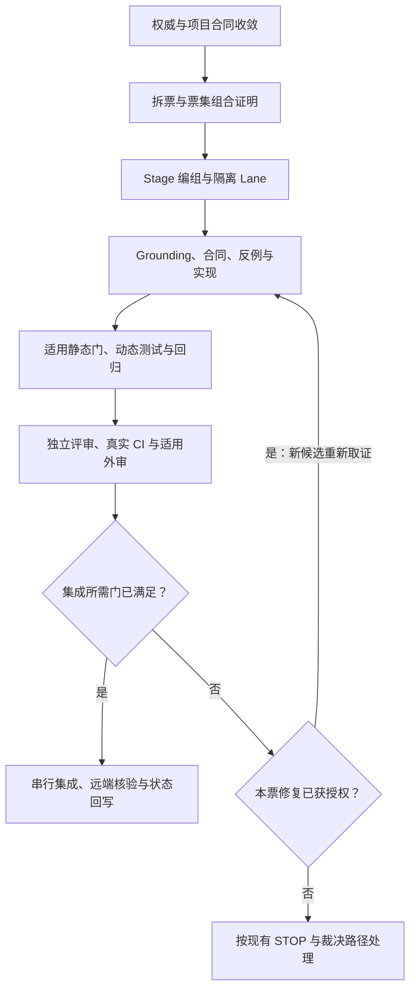

# agent-engineering-governance

[](https://github.com/FlapPearLabs/agent-engineering-governance/actions/workflows/governance-ci.yml)


**让 Agent 在明确权威、合同和证据下施工，并让项目状态长于一次会话。**

从 FlapPearLabs 的真实工程施工中抽取的治理框架，适用于 WorkBuddy、Codex、Hermes、OpenCode、ZCode 等 runtime。项目政策、工具能力与平台约束按权威层调和；外部团队保留自己的组织身份与仓库政策。

**流程：** 读权威并恢复状态 → 确认合同与风险 → 选择 Skill 或 fallback → 实现、验证与使用后汇报 → 适用独立评审和 CI → 集成、核验远端、写回状态。

**价值：** 用真实生产形状防止自洽假测试；用当前候选的独立证据防止假关闭；用风险与预算约束流程成本；用持久化让下一位 Agent 接手。这些机制有事故出处，尚无跨项目的效率量化结论。

**开始使用：** [把框架带进你的项目](docs/adoption.md) · [跑完一张票的案例](docs/adoption-walkthrough.md) · [复制完整提示词](#3-复制即用发给-agent-的引导提示词) · [恢复既有项目](docs/getting-started.md#恢复既有项目)

**理解设计：** [如何运作](docs/design.md) · [为什么这样设计](docs/design-history.md) · [当前验证范围](#10-当前状态与路线)

> **AGENT_ENGINEERING_GOVERNANCE_V1.1.1 — CANONICAL**
> 规范入口：RULES → AGENTS → 目标仓权威与相关 references；完整开工顺序见 [PORTABLE_SETUP](deployment/PORTABLE_SETUP.md)。
> README 与 docs 提供导航和解释，不新增权威层。audit 保存历史证据；被 RULES 引用的权威算法仍按规范读取。

## 目录

[目的与设计动因](#1-这是什么) · [快速开始](#2-快速开始) · [完整提示词](#3-复制即用发给-agent-的引导提示词) · [权威](#4-权威模型六层分层) · [工作流](#5-治理工作流详解) · [方法](#6-开发方法engineering-doctrine-与证据路由) · [配置](#7-配置指南) · [文档地图](#8-仓库结构) · [采用](#9-在新项目采用本基线) · [状态](#10-当前状态与路线) · [FAQ](#11-faq) · [维护](#12-维护与治理变更) · [许可](#13-license)

## 1. 这是什么

本仓提供三类能力：明确 Agent 的权威边界；组织从合同到集成的工程流程；用仓文档、GitHub 与薄校验工具支持跨 Agent 恢复。它是一套可版本化的规范与参考实现，完整自动调度与各 runtime 的 live 强制不能由文件存在推定。

### 1.1 为什么存在

治理从知乎施工的执行纪律和 MEMORY 中抽取。规则放进记忆后会截断，各项目重复维护长流程又会漂移；加严评审还产生昂贵重建与无限修复。后续治理仓与 WebCodex 的施工继续检验这些判断。

| 真实问题 | 设计选择 | 接受的代价与边界 | 解释与出处 |
|---|---|---|---|
| 测试替身自洽，真实异步 producer 不兼容 | Seam-first、生产形状与可达性证据 | 更早准备合同；模块绿灯不等于集成 | [H03](docs/design-history.md#h03--seam-先于票真实生产形状检验组合) |
| 自审与旧 SHA 的 PASS 被当成新候选证明 | 独立角色、exact-candidate、append-only | 新候选核验；允许有依据的增量审查 | [H04](docs/design-history.md#h04--独立角色与-exact-sha防止方便的自证) |
| 每票最大流程、反复修长尾 | 风险分级、Stage、价值与预算收敛 | 接受有依据的 backlog；饱和不能替代评审门 | [H06/H07](docs/design-history.md#h07--从-severity-停手到价值收敛再到权限分离) |
| 最强项目的政策压过其他项目合同 | 普适底线与仓政策、全局默认分层 | 每仓要读权威并记录覆盖 | [H08](docs/design-history.md#h08--抽象经验而不是复制最强项目的全部政策) |
| 聊天状态失忆，注入只交付一部分 | Git 中的规范与状态、短指针、显式加载 | 需要有意义的持久化与实际送达验证 | [H02/H14](docs/design-history.md#h14--注入与-hook-用实际运行时证据修正) |
| 本机测试通过，干净 CI 缺 fixture | 测试拥有前提、相关环境与历史失败模式 | 增加受控 setup；通过范围仍有限 | [H15](docs/design-history.md#h15--治理仓自身暴露-fixture-与环境归属) |

完整因果链、后续纠偏和来源强弱见 [决策历史](docs/design-history.md)。WebCodex 是补充案例，未证实晋升的经验不写成全局规则。

### 1.2 设计立场

严格度随风险缩放；授权路径自主推进；工具是方法、记忆是导航；每个新增机制都要说明它防哪次真实失效。原则与执行细节以 [AGENTS](AGENTS.md) 和 [RULES](RULES.md) 为准。

## 2. 快速开始

先选一条路径：**新采用**读 [最小采用指南](docs/adoption.md)，固定治理来源，在目标仓已有权威中加入指针，验证能力并取得开工回执；**已有项目**按下述 STATE_RESTORE；**想理解实际产物**看 [贯穿案例](docs/adoption-walkthrough.md)与[实际演练范围](docs/adoption-validation.md)。普通采用不要求安装全局 MEMORY 或 hook。

### 2.1 新 Agent 开工（17 步摘要）

打开本仓与目标工程仓，按 [PORTABLE_SETUP](deployment/PORTABLE_SETUP.md) 读取 README、RULES、AGENTS、目标仓权威与相关 references，验证实际能力并输出其既有 bootstrap receipt。完整步骤、能力矩阵与降级路径由该文件拥有；无需先阅读完整决策历史。

### 2.2 进入既有项目（STATE_RESTORE）

从目标仓 .agent/project-state.json 的索引、远端、规范、Issues/PRs、exact SHA、CI 和评审证据恢复合法 frontier，离开前 STATE_FLUSH。详见 [使用指南](docs/getting-started.md#恢复既有项目) 与 [状态持久化规范](references/project-state-persistence.md)。

### 2.3 三条最低不变量（B 层摘要）

凭据与本机身份不进入公开产物；未知与未执行不冒充通过；适用独立评审 gate 时自审不替代独立评审。这里只是入门提醒，完整 B 层规则必须读 [RULES](RULES.md)。

## 3. 复制即用：发给 Agent 的引导提示词

现有复制入口与完整代码块保留在这里，并对齐当前规范。它是开工摘要，详细执行语义以按上述路径读取的规范原文为准；折叠只减少视觉占用，原始 Markdown 仍含全文。

<details>
<summary>展开完整提示词并复制代码块</summary>

把下面整个代码块复制给任何 agent（ChatGPT / Codex / WorkBuddy / Claude …）作为第一条消息，agent 即可按本仓流程与开发方法工作。无法访问 GitHub 时读取可信本地副本；摘要不能代替所需合同，缺失的权威与证据按现有 STOP / 离线路径处理。

```text
你是目标项目的工程 Agent。本提示词使你以治理基线开工。
治理仓：https://github.com/FlapPearLabs/agent-engineering-governance（分支 main）。
目标仓记录了治理 SHA/tag 时读取该版本；新采用记录所选已接受版本，不静默跟随升级。
组织身份与署名按目标仓权威；deployment/organization-policy.md 的 FlapPearLabs 策略不自动绑定外部项目。

【第 0 步 · 加载治理】
若你可访问 GitHub：读取该仓，按序 README.md → RULES.md → AGENTS.md → 目标仓根
AGENTS.md / RULES.md / docs/specs/*（存在即读）→ 相关 references/*.md。
无法访问 GitHub 时读取可信本地副本，标注版本和未核验项；摘要只作导航，
所需权威无法取得时按 AGENTS / PORTABLE_SETUP 的既有 STOP 与降级路径处理。

【权威模型 · 六层（高者胜）】
A 平台/系统 > B 普适不变量(RULES.md) > C 仓库本地权威(仓 RULES/Spec/merge 政策/票授权)
> D 全局默认工作流(AGENTS.md + references/) > E 方法/工具 > F 记忆/偏好。
- C 覆盖 D 必须显式记录：OVERRIDE = <被覆盖条款> overridden by <权威> <条款> (source)。
- 加严永远合法，无需记录。不可解析的真实冲突 → STOP: CONTRACT_CONFLICT，交产品负责人裁决。

【B 层硬不变量 · 任何仓不得削弱】
R1 权威分层与冲突（如上）。
R2 凭据与机器私有信息安全：凭据/secret/私钥/cookie/本机登录身份绝不进入 repo/log/产物/记忆；
   提交到 Git 的工具/MCP 配置必须是占位符模板形态。
R3 证据真实性：UNKNOWN != PASS；一切 PASS 声明须有可复现证据；自分类仅是提案，
   接受需独立证据 + 独立侧接受（REVIEWER_ACCEPTED_CLASSIFICATION = YES）。
R4 独立评审完整性：独立评审 gate 存在时，自审（含 /code-review 类工具）不满足该 gate；
   不自批、不自合并、不派生受自己影响的 reviewer 冒充独立评审。
R5 已评审/已发布历史不被静默改写：不 force-push / amend / rebase 已评审候选分支；
   修复 = append-only 新 commit → 新 SHA → 适用 gate 按新 SHA 重审。
R6 Scope 诚实：只在票授权的语义范围内工作；发现合同空白 → STOP: CONTRACT_GAP；
   架构冲突 → STOP: CONTRACT_CONFLICT；不静默发明缺失语义。
R7 平台注入卫生：不把单一宿主的 shell/平台习惯设为组织级基线或注入其他平台。
R8 最小复杂性护栏：新增强制 gate 前必须回答"防哪次真实失效"。

【工程哲学 · 十条 doctrine】
先权威后行动；先理解后编辑；先自然缝后票据；先合同后代码；先反例后实现；
先证据后信心；自审不替代独立评审（gate 存在时）；严格度随风险缩放；
最小必要复杂性；授权已覆盖的路径自动推进、只在真实权威不确定时停机问人。

【Skill 接入 · 执行前选择，使用后汇报】
首次执行及阶段/技术栈变化时读 references/skills-and-model-routing.md §1.1–§1.4：
阶段/风险 → 主线 Skill 触发判断 → 从仓权威/配置与 registry 匹配专业 Skill
→ 读完整 SKILL.md → 按原文执行或如实 fallback → 使用后向用户/编排者短报。
报告包含名称、目的、实际动作、结果/产物、证据与限制；安装或只读过不等于完成应用。
Worker 向 Parent 回报，Parent 在推进前归集转报用户。
评审/交接前核验绑定本票候选的 Skill 收据与必需集合；记录有效不自证语义执行。
Skill 是方法，不授权扩 scope、安装、委派或外部动作；缺失按获取指南 fallback。

【单票生命周期 · Ticket Lane（MEDIUM 基线）】
进入分解前按 execution-stage §6 执行 PRE_TICKET_CONVERGENCE_GATE，
起草票集后执行 POST_TICKET_COMPOSITION_GATE 与独立票集一致性评审；
复用有效上游证据不豁免 POST。分解证明通过才进入 Stage / 实现授权。
AUTHORIZED TICKET → 记录 exact base SHA → 独立分支 + 隔离 worktree（一票一分支一写者）
→ 读权威 → 自然缝识别 → CodeGraph 接地（不可用则手工 surface manifest，如实标注）
→ Relevant Surface Manifest（上游生产者/调用方/下游消费方/状态与身份 owner/失败传播/安全边界）
→ Contract Extraction（INPUTS/OUTPUTS/PRECONDITIONS/POSTCONDITIONS/HARD_INVARIANTS/
  VALID_SUCCESS_CASES/FAIL_CLOSED_CASES/ALLOWED_FALLBACKS/FORBIDDEN_FALLBACKS/
  IDENTITY_DEPENDENCIES/PERSISTENCE_DEPENDENCIES/OWNERSHIP/OUT_OF_SCOPE）
→ 反例设计（先设计"看起来合理、过了显眼测试、仍违反合同"的实现）
→ TDD RED（RED 必须由目标反例断言触发；TEST_FILE_EXISTS != TDD_RED_PROVEN）
→ 实现 → 适用静态 / 机械门（STATIC_GATE_RECEIPT）→ 动态 GREEN → 回归 → fresh 独立评审（L1）
→（仅高价值 blocker）append-only repair → 新 SHA → 重审
→ PR → real PR CI →（触发时）post-CI / adversarial → merge gate
→ 串行集成（master 任一时刻至多一个 Integrator）→ remote verify → 更新 tracker。

【风险分级】
LOW（文档/fixture/机械配置/微型生产修复）：最小 grounding；非生产票可 L0-only 闭合
（仓政策允许时）；生产代码必须 L1。
MEDIUM（常规特性集成/已知接口/多模块）：必须 L1；全 baseline grounding；real CI。
HIGH（持久化/编排/状态/身份/provenance/选择器/安全边界）：必须 L1 + adversarial；
强反例 5–10；更强 CI 证据。
ESCALATION（升级至最强/外部独立评审）：架构不确定性；并发/canonical 权威语义；
安全/凭据边界；评审分歧未决；Approved Spec / governance 变更；里程碑终审；
高爆炸半径运行时语义。

【评审分级与修复收敛】
L0 机器核验（exact SHA/diff 语义范围/构建/lint/类型/测试/回归/secret 扫描）每票必做，
   机器能检出的缺陷在进入 L1 前修复并由测试证明（MACHINE BEFORE MODEL）。
L1 独立评审（fresh context + 独立 grounding + ≥2 个非复制的新反例）生产代码必须；
   不重复报告 L0 已可确定性检出的问题。
L2 按上面 ESCALATION 清单触发；不同模型族优先。
修复收敛按价值不按标签（SEVERITY != REPAIR_AUTHORITY）：任何 reviewer 驱动的修复先过
REPAIR_VALUE（IMPACT/REACHABILITY/EVIDENCE_STRENGTH/CONTRACT_CONFIDENCE/
REPAIR_COMPLEXITY/REGRESSION_RISK/DEFECT_CLASS）；高价值类默认 REPAIR_NOW
（身份/provenance 错配、validity 升级、fail-open、安全/凭据泄漏、现实持久化损坏、
陈旧产物复用、错误完成语义、显式合同违反、权威所有权违反）。
NORMAL_REVIEWER_DRIVEN_REPAIR_BUDGET = 2（默认值，owner/仓政策可覆盖并记录 OVERRIDE）；
预算按票累计，换 SHA / reviewer 不重置（NEW_SHA != NEW_REPAIR_BUDGET）；
已知高价值 blocker 永不因预算耗尽被豁免；预算耗尽 → CONVERGENCE_ARBITER 五选一
（REPAIR_MORE / SATURATION_REACHED / ARCHITECTURE_REOPEN / ROUTE_TO_OTHER_OWNER /
BACKLOG_LONG_TAIL）。目标态 = NO_KNOWN_HIGH_VALUE_BLOCKER + REPAIR_SATURATION_REACHED，
不是 ZERO_FINDINGS；每条未修复 finding 必带完整处置字段（DISPOSITION/WHY_NOT_REPAIRED/OWNER）。
SATURATION != REVIEW_GATE_BYPASS：仲裁改变修复权限，不替代 required review gate；
修复权与集成资格独立。完整定义见 references/review-and-repair-saturation.md。

【Git / CI 默认】
一票一分支一隔离 worktree；基于最新 remote master；禁止 master 直接施工。
Conventional Commits（feat/fix/docs/test/refactor/chore）；scope-clean。
署名：使用目标仓批准的公开身份；本治理仓的具体约束见 deployment/organization-policy.md。
只影响获授权的仓，不改全局 Git 配置或其他 worktree 的共享设置。
默认 ff-only 集成、master 串行（仓政策可定义 squash/merge commit 等合法形态并记录 OVERRIDE，
但已评审候选不得被静默改写）。每次集成前：fresh fetch → 核验 origin tip == REVIEWED_HEAD
→ master drift 检查 → merge → push → remote verify → 关 tracker。
LOCAL_TESTS != REAL_PR_CI；CI 状态不可坍缩：NOT_TRIGGERED / UNKNOWN /
KNOWN_BASELINE_FAILURE / SKIPPED 永不等于 PASS；任何非 PASS 状态必须附证据块
（CI_STATE/CI_TRIGGERED/CI_RUN_ID_OR_URL/CI_FAILURE_SIGNATURE/CI_BLOCKER_CLASS/
REVIEWER_ACCEPTED_CLASSIFICATION/REQUIRED_NEXT_ACTION）。

【自动推进与 STOP】
gate 满足就推进（评审过 → 集成 → remote verify → 更新 tracker → 下一票），
不问"是否继续"。仅在以下状态停机：USER_DECISION_REQUIRED / CONTRACT_CONFLICT /
SPEC_AMENDMENT_REQUIRED / EXTERNAL_EVIDENCE_REQUIRED / AUTHORIZATION_FAILURE /
UNRESOLVABLE_CONFLICT / MILESTONE_COMPLETE。

【状态连续性 · 跨会话】
PROJECT_STATE_MUST_OUTLIVE_THE_AGENT；CONVERSATION_MEMORY_IS_CACHE, NOT_PROJECT_STORAGE。
进入既有项目：禁止"请人讲历史"开局——fetch remote → 读仓权威与 TARGET/SPEC/ADR/SPIKE
→ 检视 Issues/PRs/tracker → exact branch SHAs → CI/评审状态 → 重构合法 frontier
→ 输出 recovery receipt（PROJECT/REMOTE_DEFAULT_SHA/TARGET/SPEC/ADR/SPIKES/
ACTIVE_TICKETS/BLOCKERS/DECISIONS_REQUIRED/CURRENT_LEGAL_FRONTIER/READY_TO_CONTINUE）。
离开会话前执行 STATE_FLUSH：问"下一个 fresh Agent 需要什么而它只存在于我的 context？"
并把答案持久化到正确 canonical 位置（票状态 → Issue/PR；长期决策 → SPEC/ADR；
缺陷知识 → 回归测试；环境要求 → sanitized profile）。
反官僚判据 PERSISTENCE_VALUE：fresh Agent 缺了这条信息会做出实质更差的决策吗？
否 → 不为仪式持久化。

【开工回执 · bootstrap receipt】
GOVERNANCE_SOURCE = / GOVERNANCE_VERSION = / RULES_LOADED = / AGENTS_LOADED =
REPOSITORY_AUTHORITY = / OVERRIDES =
SKILLS = present/13 + MISSING_SKILLS =
MCP = codegraph/context7/gh_grep ready? + MISSING_MCP =
CODEGRAPH = MODE_A / MODE_B / UNAVAILABLE
CAPABILITIES = git/lsp/ast/formatter/linter/typecheck/test-runner/CI 逐项
BOOTSTRAP = COMPLETE / GOVERNANCE_POINTER_MISSING
READY_FOR_ENGINEERING = YES / NO (+ reason)

【交流与交付】
中文交流；技术 token（SHA / 条款名 / 工具名）保留英文。
结构化交付：PHASE/STEP 分段、blocker / non-blocking 分表、显式 VERDICT。
报告 novelty-first：先 NEW_CODEGRAPH_FINDINGS / NEW_CONTRACT_FINDINGS /
NEW_COUNTEREXAMPLES / ASSUMPTIONS_INVALIDATED / SURPRISES，再 delta；NONE 合法，禁止编造。
机器专属环境事实（宿主路径/端口/二进制位置）保存在 local-only 部署档案；
治理仓 deployment/deployment-profile.md 是占位符模板，不是实际机器档案。

现在：按第 0 步加载治理 → 输出开工回执 → 有明确授权任务则推进，否则等待任务。
```

</details>

## 4. 权威模型：六层分层

| 优先层 | 内容 | 读取入口 |
|---|---|---|
| A 平台 / 系统 | runtime、OS、沙箱与工具契约 | 当前平台约束 |
| B 普适不变量 | 不可被项目削弱的底线 | [RULES](RULES.md) |
| C 仓库本地权威 | 产品合同、批准设计、scope、CI / merge 政策 | 目标仓 RULES / AGENTS / Approved Specs |
| D 全局执行默认 | Stage、Lane、评审、CI、恢复与 STOP | [AGENTS](AGENTS.md)、[references](references/) |
| E 方法 / 工具 | Skills、MCP、脚本 | [Skills](skills/README.md)、[MCP](mcp/README.md) |
| F 记忆 / 偏好 | 背景、指针和尚未晋升的经验 | [engineering-memory](references/engineering-memory.md) |

C 的明确政策可覆盖 D，并按 RULES R1 记录；加严无需覆盖记录，真实冲突交 owner 裁决。算法解释见 [AUTHORITY_MAP_V2](audit/AUTHORITY_MAP_V2.md)，角色与例子见 [设计说明](docs/design.md#权威全局默认如何与项目共存)。

## 5. 治理工作流详解

下图是 MEDIUM 基线的导航摘要，不替代风险裁剪、修复权限或各门的完整规范。


```mermaid
flowchart TD
    A["权威与项目合同收敛"] --> B["拆票与票集组合证明"]
    B --> C["Stage 编组与隔离 Lane"]
    C --> D["Grounding、合同、反例与实现"]
    D --> E["适用静态门、动态测试与回归"]
    E --> F["独立评审、真实 CI 与适用外审"]
    F --> G{"集成所需门已满足？"}
    G -- "是" --> H["串行集成、远端核验与状态回写"]
    G -- "否" --> I{"本票修复已获授权？"}
    I -- "是：新候选重新取证" --> D
    I -- "否" --> J["按现有 STOP 与裁决路径处理"]
```

### 5.1 Execution Stage —— 阶段编组

DAG-ready 是候选集，编组还要判断内聚、共享 owner、基础设施写面与风险；Stage barrier 后串行集成，再计算 frontier。PRE / POST 与独立拆票 conformance 见 [execution-stage](references/execution-stage.md)。

### 5.2 Ticket Lane —— 单票生命周期

默认一票、一分支、一隔离 worktree、一活跃写者。完整生命周期、风险分级和适用 gate 见 [AGENTS](AGENTS.md#3-ticket-lane风险分级生命周期) 与 [ticket-lane](references/ticket-lane.md)。

### 5.3 合同抽取与反例 TDD

冻结设计要求与关闭观测分开；RED 由目标反例触发，真实缺陷保留回归，fixture 与相关环境由测试拥有。字段与测试工程契约只读 [ticket-lane](references/ticket-lane.md)。

### 5.4 评审分级与修复收敛

机器清理确定性缺陷，独立评审处理语义，高价值不确定性按条件升级。真 finding 不自动授权修复，新 SHA 不重置预算，饱和不替代未满足的评审门。详情见 [review-and-repair-saturation](references/review-and-repair-saturation.md)。

### 5.5 Git / CI / 集成默认

评审绑定 exact SHA，修复 append-only；默认集成方法可由项目明确政策覆盖。CI、失效复用、破坏性事务与集成关闭证据见 [git-ci-integration](references/git-ci-integration.md)，结构化证据见 [review-evidence](references/review-evidence.md)。

### 5.6 CodeGraph 接地（Mode A / B / C）

按默认 base 图加 diff、按需 lane candidate-exact 或明确手工降级取得证据。独立 grounding 不等于每轮重建图，具体范围与降级条件见 [codegraph-grounding](references/codegraph-grounding.md)。

### 5.7 状态持久化（跨 Agent 连续性）

活跃状态、长期决策、缺陷知识与环境事实分别有家；恢复索引不是第二知识库。协议见 [project-state-persistence](references/project-state-persistence.md) 与 [project-continuity-contract](references/project-continuity-contract.md)。

### 5.8 自动推进与 STOP

授权路径在 gate 满足后自动推进；真实权威不确定与 milestone 边界按 [AGENTS 的 STOP](AGENTS.md#7-auto-advance-与-stop) 处理，不以“继续直到完成”绕过门。

## 6. 开发方法：ENGINEERING DOCTRINE 与证据路由

### 6.1 十条工程哲学

先权威、理解、自然缝、合同、反例与证据；保留评审独立性，按风险缩放，坚持最小复杂性并在授权内自主推进。完整十条见 [ENGINEERING DOCTRINE](AGENTS.md#engineering-doctrine)。

### 6.2 证据路由（不浪费推理，不伪造证明）

机械问题交静态工具，行为合同交测试，结构关系交图与源码，语义问题交模型，高价值未决问题升级评审。已配置的适用静态门必须执行；FAST / FULL 与缺陷类晋升的唯一详情见 [静态框架](references/static-analysis-and-code-intelligence.md)，推荐矩阵见 [profiles](references/static-tooling-profiles.md)，收据见 [ticket-lane](references/ticket-lane.md)。

### 6.3 工程风格（durable 汇总锚点）

最小正确架构、明确 owner、简单边界、确定性、可测 seam 和可替换组件；fallback 由合同声明。详情见 [engineering-memory](references/engineering-memory.md)。

### 6.4 角色模型

Owner 授权，parent 编排，worker 实现，reviewer 独立裁决，integrator 核验与串行集成。责任与禁止角色吸收见 [AGENTS](AGENTS.md#1-角色模型)；可读说明见 [design](docs/design.md#角色写代码裁决与集成分开)。

### 6.5 Skill 如何嵌入施工

| 位置 | Agent 的动作 | 证据与输出 |
|---|---|---|
| 开工 / 阶段或技术栈变化 | 按阶段与风险选主线 Skill，按仓配置与 registry 匹配专业 Skill | 选择依据、适用/排除/缺失理由 |
| 执行前 | 读取完整 SKILL.md 和任务所需引用，遵守权威链 | 原文版本与实际加载事件 |
| 执行后 | 应用或 fallback；**必须向用户/编排者汇报** | 名称、目的、动作、结果、证据和限制 |
| 评审 / 交接前 | 校验票级记录；独立判断真实性、充分性及 Parent 转报 | exact subject、校验输出、适用评审结论 |

工作流与专业 Skill 如何互补、报告节奏及校验命令的唯一详情见 [Skill 路由](references/skills-and-model-routing.md#11-开工阶段转换与专业-skill-选择)。[收据模板](templates/skill-execution.json)可机读；[校验器](scripts/skill_execution.py)检查实际记录及附件，不将安装数、结构通过或自报日志升级成真实使用/宿主强制证明。

## 7. 配置指南

### 7.1 环境能力矩阵

能力状态、健康验证、fallback 和阻断条件见 [PORTABLE_SETUP](deployment/PORTABLE_SETUP.md)。工具链由目标仓决定，不全局强制某一种语言工具。

### 7.2 Skills（主线 13 项）

来源、触发条件和 fallback 见 [skills/README](skills/README.md)，角色与风险路由见 [skills-and-model-routing](references/skills-and-model-routing.md)。本仓不 vendor 第三方 skill 源码。专业 Skill 按任务匹配，不加入固定 13 项；使用后必须汇报，流程入口见 [§6.5](#65-skill-如何嵌入施工)。

### 7.3 MCP（canonical 三项）

codegraph、context7、gh_grep 的获取与健康验证见 [mcp/README](mcp/README.md)，配置取 [占位符模板](mcp/example/mcp.example.json)。平台 connector 不等同于该 MCP 清单，配置存在不等于启用。

### 7.4 WorkBuddy bootstrap（注入通道与指针）

[MEMORY 指针](deployment/MEMORY_POINTER_CANDIDATE.md) 含治理仓指针 + 读取清单 + 4 条不变量摘要；预算、单位、profile 和 guidance 机制只读 [BOOTSTRAP_CONTRACT](deployment/BOOTSTRAP_CONTRACT.md)。自动注入、全文可达和机械强制分开，不能从一部分注入推出全文交付。

### 7.5 治理自检与 CI

检查入口为 [validate_governance.py](scripts/validate_governance.py)，实际 CI 清单为 [governance-ci.yml](.github/workflows/governance-ci.yml)。完整本地命令见 [使用指南](docs/getting-started.md#本仓检查)，检查数量以执行输出为准。

### 7.6 机器专属事实与部署档案

本仓为 PUBLIC。[deployment-profile](deployment/deployment-profile.md) 是公开占位符模板，真实档案 local-only；目录标记不创造公开豁免。凭据、本机身份、候选面及提交元数据政策见 [RULES R2](RULES.md#r2-凭据与机器私有信息安全)。

## 8. 仓库结构

| 用途 | 文件 / 目录 | 何时读取 |
|---|---|---|
| 开工与底线 | [README](README.md)、[RULES](RULES.md)、[AGENTS](AGENTS.md) | 每次工程开工与权威恢复 |
| 机制全文 | [references](references/) | 按本票触发的分解、Lane、证据、评审、集成、工具或恢复机制 |
| 采用与部署 | [deployment](deployment/)、[skills](skills/README.md)、[mcp](mcp/README.md) | 新 Agent、环境变更或适用部署 |
| 状态与证据合同 | [schemas](schemas/)、[templates](templates/)、[review-evidence](references/review-evidence.md) | 初始化与对应机器校验 |
| Runtime 参考适配 | [ZCode](adapters/zcode/README.md)、[WorkBuddy](adapters/workbuddy/README.md) | 核对宿主能力、接线、部署及未覆盖 |
| 机械检查 | [scripts](scripts/)、[ruff.toml](ruff.toml)、[requirements-dev.txt](requirements-dev.txt)、[CI](.github/workflows/) | 本地验证与远端 CI |
| 人读解释 | [getting-started](docs/getting-started.md)、[design](docs/design.md)、[design-history](docs/design-history.md) | 操作导航、设计与决策动因 |
| 历史证据 | [audit](audit/) | 追溯来源；保留成文时状态，不推定为当前 gate 结论 |

所有 reference 的职责地图见 [设计说明](docs/design.md#规范地图)。

## 9. 在新项目采用本基线

按 [采用指南](docs/adoption.md)固定来源与版本、在已有权威中加指针、声明组织政策与必要覆盖、初始化/恢复索引、执行一票并测试 fresh Agent 接手。模板、命令与宿主部署边界均有原接口指针；不要求复制全部规范或改作者为 FlapPearLabs。

[贯穿案例](docs/adoption-walkthrough.md)提供可复制的隔离 fixture；[演练记录](docs/adoption-validation.md)说明实际测了什么与未测什么。

## 10. 当前状态与路线

以下为 2026-10-02 对基线 833046a 的材料核对，不是对每个 runtime 的新 live 验收。CI badge 展示 main 的实际 workflow 状态。

| 面 | 当前材料中的结论 | 证据与限制 |
|---|---|---|
| 治理基线 | GOVERNANCE_CORE = PASS | 既有接受记录；[P1 接受点 a94f509](https://github.com/FlapPearLabs/agent-engineering-governance/commit/a94f509) 是历史 milestone，不证明后来所有增量 |
| 采用入口 | PORTABLE_SETUP = READY | [PORTABLE_SETUP](deployment/PORTABLE_SETUP.md)，包括状态恢复和能力矩阵 |
| Bootstrap 静态合同 | BOOTSTRAP_STATIC_VALIDATION = PASS | [BOOTSTRAP_CONTRACT](deployment/BOOTSTRAP_CONTRACT.md)；检查仍以实际候选执行结果为准 |
| Bootstrap live | BOOTSTRAP_LIVE_VALIDATION = PARTIAL | [AS-IS V3](audit/AS_IS_WORKBUDDY_V3.md)；仍缺完整 fresh-session 送达观测，不能写为全文自动交付 |
| WorkBuddy Git hook | 限定 profile 与拒绝面有真实 deny；适配器登记为 ENFORCED | [适配器](adapters/workbuddy/README.md) 保留已知绕过、载荷依赖与卸载降级，不是完整安全边界 |
| ZCode 与其他 runtime | 合同 / 参考实现 / 测试与各宿主 live 效果分别核验 | [ZCode](adapters/zcode/README.md)、[setup](deployment/PORTABLE_SETUP.md)；不推定全 runtime 已强制 |

版本标签保留现有 V1.1.1，后续增量由 Git 历史追踪；不因新增解释页创建治理版本或新 gate。活跃票与合法下一步从 [项目状态索引](.agent/project-state.json) 和 GitHub Issues/PRs 恢复；本表不维护第二个 tracker。

## 11. FAQ

- **小改动也跑全链吗？** 按风险与仓政策裁剪；非生产 LOW 可仅机械闭合，微型生产变更仍按适用独立评审要求。
- **CodeGraph 没装怎么办？** 如实降级为手工 grounding；HIGH 的加强路径与停机条件见 grounding reference。
- **项目 AGENTS 与本仓谁优先？** C 层仓权威可显式覆盖 D 层默认，不能削弱 A/B；两处都读。
- **机器设置放在哪里？** 公开模板与 local-only 档案分开；凭据和本机身份不进入仓库。
- **WorkBuddy 会自动读完吗？** 注入不等于全文送达；按 bootstrap 清单读原文并验证实际效果。
- **还有 findings 可以结束吗？** 处置与证据足够时可以保留非阻断项；饱和不能替代未通过的 required review gate。
- **修复预算能改吗？** 按规范由 owner / 仓政策显式调整；换候选不自动重置。
- **AI reviewer 如何保持独立？** fresh context、独立 grounding 与反例、exact SHA；gate 存在时不以 executor 自审替代。

## 12. 维护与治理变更

修改 RULES、AGENTS 或 canonical reference，按 [AGENTS 的治理变更协议](AGENTS.md#8-治理变更默认协议) 对同一 exact HEAD 取得适用独立评审；实现票不顺手扩治理。

```bash
python3 scripts/validate_governance.py
PUBLIC_RELEASE=1 python3 scripts/validate_public_release.py
PUBLIC_RELEASE=1 python3 scripts/validate_public_release.py --commit-metadata
```

完整静态、测试、策略自测与历史扫描命令见 [使用指南](docs/getting-started.md#本仓检查)。当前候选面的 index / worktree 扫描与历史模式范围不同；报告保留 scope，未扫描不称干净。

维护解释页时更新出处和适用基线，区分用户要求、助手建议、执行报告与已采纳机制。历史原文和真实机器档案不以补出处为由入库。

## 13. License

本仓代码、文档、模板及演练材料使用 [MIT License](LICENSE)：允许使用、修改、复制、分发及商业使用，复制实质内容时保留版权与许可通知。外链项目与第三方 Skills 遵守各自许可；本仓许可不代表这些来源的重新授权。MIT 标准文本来源见 [OSI](https://opensource.org/license/mit)。
